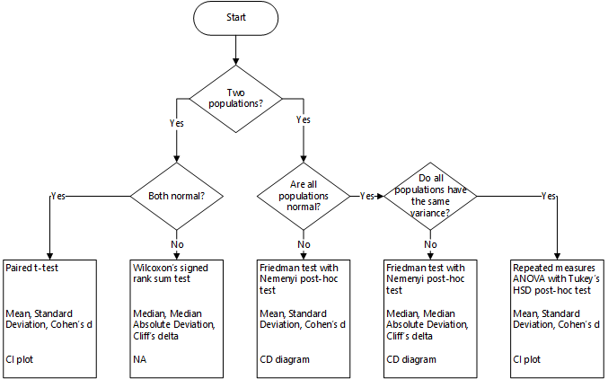
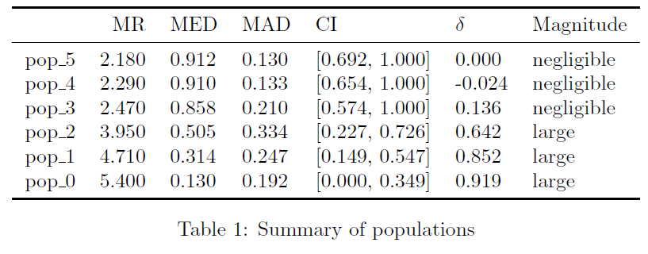

# Autorank

[](https://github.com/sherbold/autorank/actions)
[](https://codecov.io/gh/sherbold/autorank)


## Summary

Autorank is a simple Python package with one task: simplify the comparison between (multiple) paired populations. 
The goal of Autorank is to simplify the statistical analysis for non-experts. The statistical approach of this package
is based on the article 
_Janez Demšar. 2006. Statistical Comparisons of Classifiers over Multiple Data Sets. J. Mach. Learn. Res. 7 (December 2006), 1–30_. 

## Installation

Autorank is available on PyPi and can be installed using pip.

```
pip install autorank
```

## Description

Autorank uses the following strategy for the statistical comparison of paired populations:
- First all populations are checked with the Shapiro-Wilk test for normality. We use Bonferoni correction for these
  tests, i.e., alpha/#populations.
- If all columns are normal, we use Bartlett's test for homogeneity, otherwise we use Levene's test.
- Based on the normality and the homogeneity, we select appropriate tests, effect sizes, and methods for determining
  the confidence intervals of the central tendency.

If all columns are normal, we calculate:
- The mean value as central tendency.
- The empirical standard deviation as measure for the variance.
- The confidence interval for the mean value.
- The effect size in comparison to the highest mean value using Cohen's d.

If at least one column is not normal, we calculate:
- The median as central tendency.
- The median absolute deviation from the median as measure for the variance.
- The confidence interval for the median.
- The effect size in comparison to the highest ranking approach using Cliff's delta.

For the statistical tests, there are four variants:
- If there are two populations and both populations are normal, we use the paired t-test.
- If there are two populations and at least one populations is not normal, we use Wilcoxon's signed rank test.
- If there are more than two populations and all populations are normal and homoscedastic, we use repeated measures
  ANOVA with Tukey's HSD as post-hoc test.
- If there are more than two populations and at least one populations is not normal or the populations are
  heteroscedastic, we use Friedman's test with the Nemenyi post-hoc test.
  
We use the paired t-test, the Wilcoxon signed rank test, and the Friedman test from [scipy](https://www.scipy.org/). The
repeated measures ANOVA and Tukey's HSD test (including the calculation of the confidence intervals) are used from
[statsmodels](statsmodels). We use own implementations for the calculation of critical distance of the Nemenyi test,
the calculation of the effect sizes, and the calculation of the confidence intervals (with the exception of Tukey's
HSD).

The following flow chart summarizes the decisions made by Autorank.
 

  
## Usage Example

The following example shows the usage of `autorank`. First, we import the functions from autorank and create some data. 
```python
import numpy as np
import pandas as pd
from autorank.autorank import autorank, plot_stats, create_report, latex_table

np.random.seed(42)
pd.set_option('display.max_columns', 7)
std = 0.3
means = [0.2, 0.3, 0.5, 0.8, 0.85, 0.9]
sample_size = 50
data = pd.DataFrame()
for i, mean in enumerate(means):
    data['pop_%i' % i] = np.random.normal(mean, std, sample_size).clip(0, 1)
```

The statitistical analysis of the data only requires a single command. As a result, you get a named tuple with all relevant information from the statistical analysis conducted.  
```python
result = autorank(data, alpha=0.05, verbose=False)
print(result)
``` 
Output: 
```
RankResult(rankdf=
       meanrank    median       mad  ci_lower  ci_upper  effect_size    mangitude
pop_5      2.18  0.912005  0.130461  0.692127         1  2.66454e-17   negligible
pop_4      2.29  0.910437  0.132786  0.654001         1       -0.024   negligible
pop_3      2.47  0.858091  0.210394  0.573879         1       0.1364   negligible
pop_2      3.95  0.505057  0.333594  0.227184   0.72558       0.6424        large
pop_1      4.71  0.313824  0.247339  0.149473  0.546571       0.8516        large
pop_0      5.40  0.129756  0.192377         0  0.349014       0.9192        large
pvalue=2.3412212612346733e-28,
cd=1.0662484349869374,
omnibus='friedman',
posthoc='nemenyi',
all_normal=False,
pvals_shapiro=[1.646607051952742e-05, 0.0605173334479332, 0.13884511590003967, 0.00010030837438534945,
               2.066387423838023e-06, 1.5319776593969436e-06],
homoscedastic=True,
pval_homogeneity=0.2663177301695518,
homogeneity_test='levene')
alpha=0.05, 
alpha_normality=0.008333333333333333, 
num_samples=50)
```

You can go ahead and use this tuple to create your own report about the statistical analysis. Alternatively, you can use
autorank for this task.  
```python
create_report(result)
```
Output:
```
The statistical analysis was conducted for 6 populations with 50 paired samples.
The family-wise significance level of the tests is alpha=0.050.
We rejected the null hypothesis that the population is normal for the populations pop_5 (p=0.000), pop_2 (p=0.000), 
pop_1 (p=0.000), and pop_0 (p=0.000). Therefore, we assume that not all populations are normal.
Because we have more than two populations and the populations and some of them are not normal, we use the 
non-parametric Friedman test as omnibus test to determine if there are any significant differences between the 
median values of the populations. We use the post-hoc Nemenyi test to infer which differences are significant. We report
the median (MD), the median absolute deviation (MAD) and the mean rank (MR) among all populations over the samples. 
Differences between populations are significant, if the difference of the mean rank is greater than the critical 
distance CD=1.066 of the Nemenyi test.
We reject the null hypothesis (p=0.000) of the Friedman test that there is no difference in the central tendency of 
the populations pop_5 (MD=0.912+-0.154, MAD=0.130, MR=2.180), pop_4 (MD=0.910+-0.173, MAD=0.133, MR=2.290), pop_3 
(MD=0.858+-0.213, MAD=0.210, MR=2.470), pop_2 (MD=0.505+-0.249, MAD=0.334, MR=3.950), pop_1 (MD=0.314+-0.199, 
MAD=0.247, MR=4.710), and pop_0 (MD=0.130+-0.175, MAD=0.192, MR=5.400). Therefore, we assume that there is a 
statistically significant difference between the median values of the populations.
Based the post-hoc Nemenyi test, we assume that there are no significant differences within the following groups: 
pop_5, pop_4, and pop_3; pop_2 and pop_1; pop_1 and pop_0. All other differences are significant.
```
Our you could use Autorank to generate a plot that visualizes the statistical analysis. Autorank creates plots of the
confidence interval in case of the paired t-test and repeated measures ANOVA and a critical distance diagram for the
post-hoc Nemenyi test. 

```python
plot_stats(res)
plt.show()
```

For the above example, the following plot is created:


To further support reporting in scholarly article, Autorank can also generate a latex table with the relevant results. 
```python
latex_table(res)
```
Output:
```
\begin{table}[h]
\centering
\begin{tabular}{lrlllll}
\toprule
{} &    MR &   MED &   MAD &              CI & $\delta$ &   Magnitude \\
\midrule
pop\_5 & 2.180 & 0.912 & 0.130 &  [0.692, 1.000] &     0.000 &  negligible \\
pop\_4 & 2.290 & 0.910 & 0.133 &  [0.654, 1.000] &    -0.024 &  negligible \\
pop\_3 & 2.470 & 0.858 & 0.210 &  [0.574, 1.000] &     0.136 &  negligible \\
pop\_2 & 3.950 & 0.505 & 0.334 &  [0.227, 0.726] &     0.642 &       large \\
pop\_1 & 4.710 & 0.314 & 0.247 &  [0.149, 0.547] &     0.852 &       large \\
pop\_0 & 5.400 & 0.130 & 0.192 &  [0.000, 0.349] &     0.919 &       large \\
\bottomrule
\end{tabular}
\caption{Summary of populations}
\label{tbl:stat_results}
\end{table}
```

The rendered table looks like this (may change depending on the class of the document).
 



## License

Autorank is published under the Apache 2.0 Licence.
